---
artifact:
  kind: continuity-path
  type: domain-context
  target: "Smoke domain"

metadata:
  status: draft
  relates:
    - relation: related
      target: smoke-domain-behavior.md
      kind: document
      type: behavior
      role: "Preserva los comportamientos propios del contexto"
      recommendation: "3.3.1"
      recommendation-context: "7659C3E972CCCFEF11041446AEAF9FF75209C88BF215590E01BF4619CDA0A4AA"
    - relation: related
      target: smoke-domain-capability.md
      kind: nexus
      type: capability
      role: "Compone las perspectivas necesarias para comprender una capacidad nacida del dominio"
      recommendation: "3.4.1"
      recommendation-context: "7659C3E972CCCFEF11041446AEAF9FF75209C88BF215590E01BF4619CDA0A4AA"

tooling:
  version: build10.1130
  schema:
    version: 0.1.0
  template:
    name: domain-context.continuity-path
    version: "0.1.0"
---

# Camino de continuidad "domain-context" de Smoke domain

## Propósito del recorrido
<!-- vslices:artifact-question id=__purpose -->
Preserva continuidad entre un contexto de dominio, su lenguaje, conceptos, comportamientos y las capacidades o realizaciones que dependen de ese significado.
<!-- /vslices:artifact-question -->

## Preguntas de continuidad

### ¿Qué lenguaje, conceptos, reglas y comportamientos pertenecen a este contexto?
<!-- vslices:artifact-question id=domain-context -->
<!-- /vslices:artifact-question -->

#### ¿Qué lenguaje pertenece a este contexto?
<!-- vslices:artifact-question id=domain-language -->
<!-- /vslices:artifact-question -->

#### ¿Qué conceptos abarca?
<!-- vslices:artifact-question id=domain-concepts -->
<!-- /vslices:artifact-question -->

#### ¿Qué comportamientos expresa?
<!-- vslices:artifact-question id=domain-behaviors -->
<!-- /vslices:artifact-question -->

#### ¿Qué capacidades nacen desde este dominio?
<!-- vslices:artifact-question id=domain-capabilities -->
<!-- /vslices:artifact-question -->

#### ¿Qué productos o servicios usan este significado?
<!-- vslices:artifact-question id=domain-consumers -->
<!-- /vslices:artifact-question -->

#### ¿Qué decisiones delimitan este contexto?
<!-- vslices:artifact-question id=context-boundaries -->
<!-- /vslices:artifact-question -->

## Diagrama de continuidad

### Recorrido recomendado
<!-- vslices:artifact-question id=__recommended-traversal -->
Comenzar por el contexto, reconocer su lenguaje y conceptos, seguir sus comportamientos y capacidades, y terminar observando qué productos, servicios y decisiones dependen de esos significados.
<!-- /vslices:artifact-question -->

### Grafo

```mermaid
flowchart TD
  q_646f6d61696e2d636f6e74657874["¿Qué lenguaje, conceptos, reglas y comportamientos pertenecen a este contexto?"]
  q_646f6d61696e2d636f6e74657874 -- "se expresa mediante" --> q_646f6d61696e2d6c616e6775616765
  q_646f6d61696e2d6c616e6775616765["¿Qué lenguaje pertenece a este contexto?"]
  q_646f6d61696e2d6c616e6775616765_r1["document: domain-vocabulary"]
  q_646f6d61696e2d6c616e6775616765 -. "Preserva los términos y significados propios del contexto" .-> q_646f6d61696e2d6c616e6775616765_r1
  q_646f6d61696e2d636f6e74657874 -- "contiene" --> q_646f6d61696e2d636f6e6365707473
  q_646f6d61696e2d636f6e6365707473["¿Qué conceptos abarca?"]
  q_646f6d61696e2d636f6e6365707473_r1["document: domain-vocabulary"]
  q_646f6d61696e2d636f6e6365707473 -. "Preserva los conceptos incluidos en el contexto" .-> q_646f6d61696e2d636f6e6365707473_r1
  q_646f6d61696e2d636f6e6365707473_r2["document: consistency"]
  q_646f6d61696e2d636f6e6365707473 -. "Preserva reglas o invariantes que deben mantenerse coherentes" .-> q_646f6d61696e2d636f6e6365707473_r2
  q_646f6d61696e2d636f6e74657874 -- "se manifiesta mediante" --> q_646f6d61696e2d6265686176696f7273
  q_646f6d61696e2d6265686176696f7273["¿Qué comportamientos expresa?"]
  q_646f6d61696e2d6265686176696f7273_r1["document: behavior"]
  q_646f6d61696e2d6265686176696f7273 -. "Preserva los comportamientos propios del contexto" .-> q_646f6d61696e2d6265686176696f7273_r1
  q_646f6d61696e2d636f6e74657874 -- "habilita" --> q_646f6d61696e2d6361706162696c6974696573
  q_646f6d61696e2d6361706162696c6974696573["¿Qué capacidades nacen desde este dominio?"]
  q_646f6d61696e2d6361706162696c6974696573_r1["nexus: capability"]
  q_646f6d61696e2d6361706162696c6974696573 -. "Compone las perspectivas necesarias para comprender una capacidad nacida del dominio" .-> q_646f6d61696e2d6361706162696c6974696573_r1
  q_646f6d61696e2d636f6e74657874 -- "es utilizado por" --> q_646f6d61696e2d636f6e73756d657273
  q_646f6d61696e2d636f6e73756d657273["¿Qué productos o servicios usan este significado?"]
  q_646f6d61696e2d636f6e73756d657273_r1["document: context"]
  q_646f6d61696e2d636f6e73756d657273 -. "Preserva dónde se utiliza el significado del dominio" .-> q_646f6d61696e2d636f6e73756d657273_r1
  q_646f6d61696e2d636f6e74657874 -- "está delimitado por" --> q_636f6e746578742d626f756e646172696573
  q_636f6e746578742d626f756e646172696573["¿Qué decisiones delimitan este contexto?"]
  q_636f6e746578742d626f756e646172696573_r1["document: decision-record"]
  q_636f6e746578742d626f756e646172696573 -. "Preserva las decisiones que explican los límites del contexto" .-> q_636f6e746578742d626f756e646172696573_r1
```

## Artifacts asociados

<!-- vslices:associated-artifacts -->
| Artifact | Utilidad | Link |
| --- | --- | --- |
| smoke-domain-behavior | Preserva los comportamientos propios del contexto | [smoke-domain-behavior.md](smoke-domain-behavior.md) |
| smoke-domain-capability | Compone las perspectivas necesarias para comprender una capacidad nacida del dominio | [smoke-domain-capability.md](smoke-domain-capability.md) |
<!-- /vslices:associated-artifacts -->

